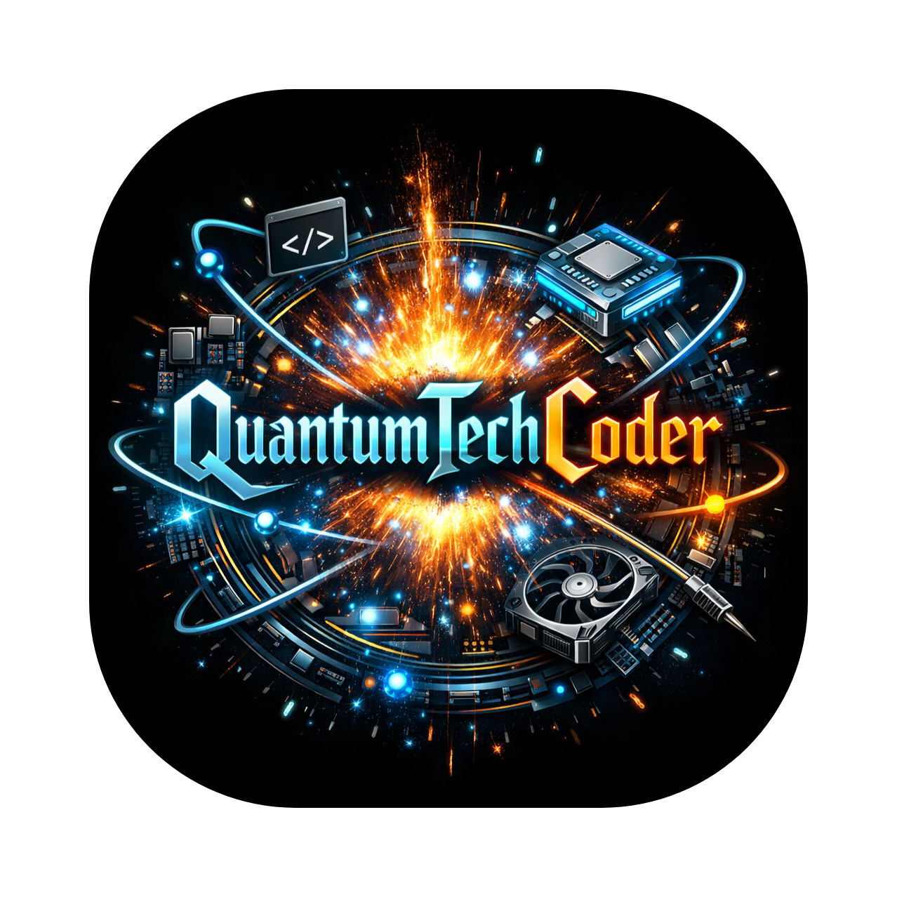

# 👋 Hi, I'm **𝕼𝖚𝖆𝖓𝖙𝖚𝖒𝕿𝖊𝖈𝖍𝕮𝖔𝖉𝖊𝖗**

[](https://github.com/QuantumTechCoder)

---

<a href="https://quantumtechcoder.is-a.dev" target="_blank" rel="noreferrer">
<picture>  
<source media="(prefers-color-scheme: dark)" srcset="https://raw.githubusercontent.com/QuantumTechCoder/QuantumTechCoder/output/snake-dark.svg">
 <source media="(prefers-color-scheme: light)" srcset="https://raw.githubusercontent.com/QuantumTechCoder/QuantumTechCoder/output/snake.svg">

</picture> 
</a> 

---

## ⚡ About Me

I'm **𝕼𝖚𝖆𝖓𝖙𝖚𝖒𝕿𝖊𝖈𝖍𝕮𝖔𝖉𝖊𝖗** — a technical person (basically technician and coder and hacker) who enjoys building software, exploring systems, ethical hacking, cybersec, pentesting, automating everything possible, experimenting with AI, and understanding technology from the inside out.

**Coder · Ethical Hacker · Technician · Software Hacker · AI Engineer · Systems Explorer**

> 🖥️ **Terminal is home.**
> ⚙️ **Antigravity is the workspace.**
> ⌨️ **CLI is life.**

---

## 🛠️ Skills & Technologies

<p align="left">
  
</p>

### 🧠 Areas

<p align="left">
  
  
  
  
  
  
</p>

---

## 📊 GitHub Stats

<p align="center">
  
  
</p>

---

## ⚙️ System Status

```text
┌─────────────────────────────────────────────┐
│             QUANTUM TECH CODER              │
├─────────────────────────────────────────────┤
│ MODE        :: ENGINEERING                  │
│ TERMINAL    :: HOME                         │
│ CLI         :: LIFE                         │
│ WORKSPACE   :: ANTIGRAVITY                  │
│ CURIOSITY   :: ∞                            │
│ PROJECTS    :: ACTIVE                       │
│ STATUS      :: BUILDING                     │
└─────────────────────────────────────────────┘
```

---

## 🧬 Philosophy

```ini
BUILD
  ↓
BREAK
  ↓
UNDERSTAND
  ↓
REBUILD
  ↓
REPEAT
```

> **I don't just use technology. I want to know how it works.**

---

<p align="center">

### `⚡ 𝕼𝖚𝖆𝖓𝖙𝖚𝖒𝕿𝖊𝖈𝖍𝕮𝖔𝖉𝖊𝖗`

**Turning unreasonable technical ideas into working systems.**

</p>
